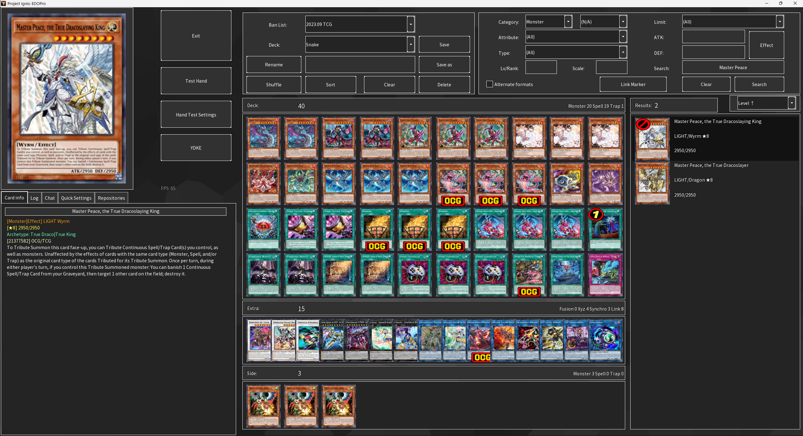
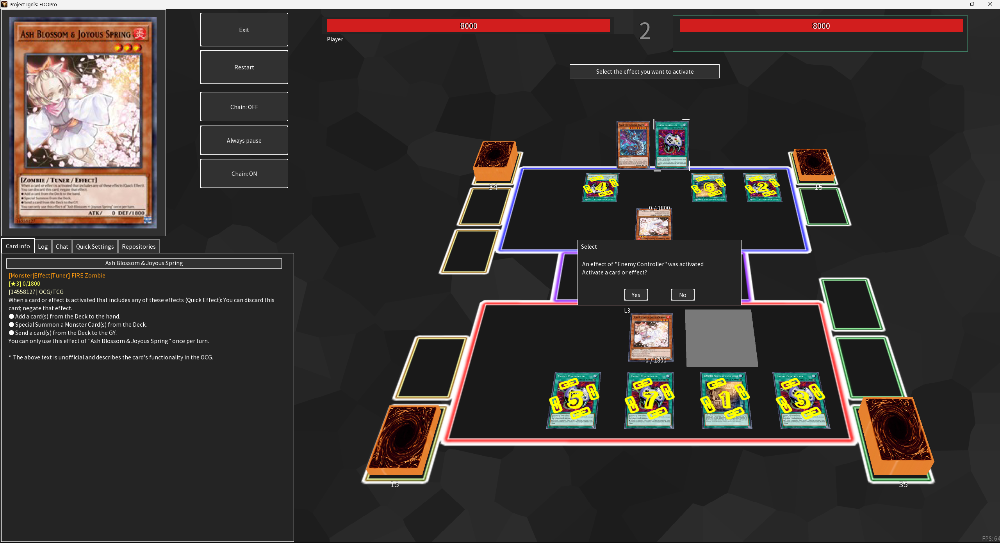
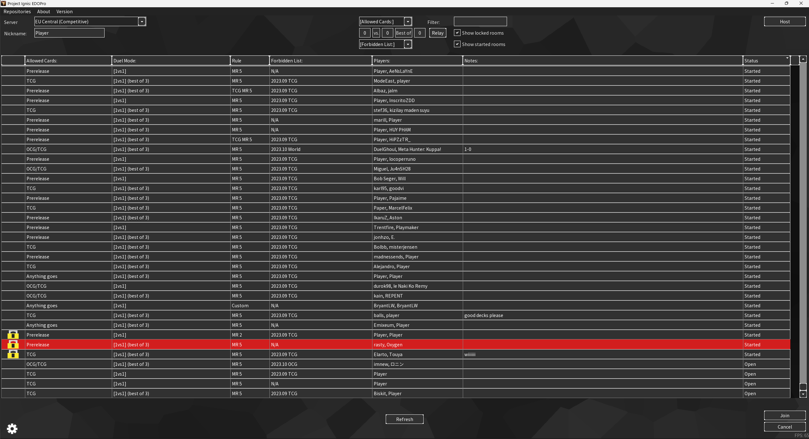
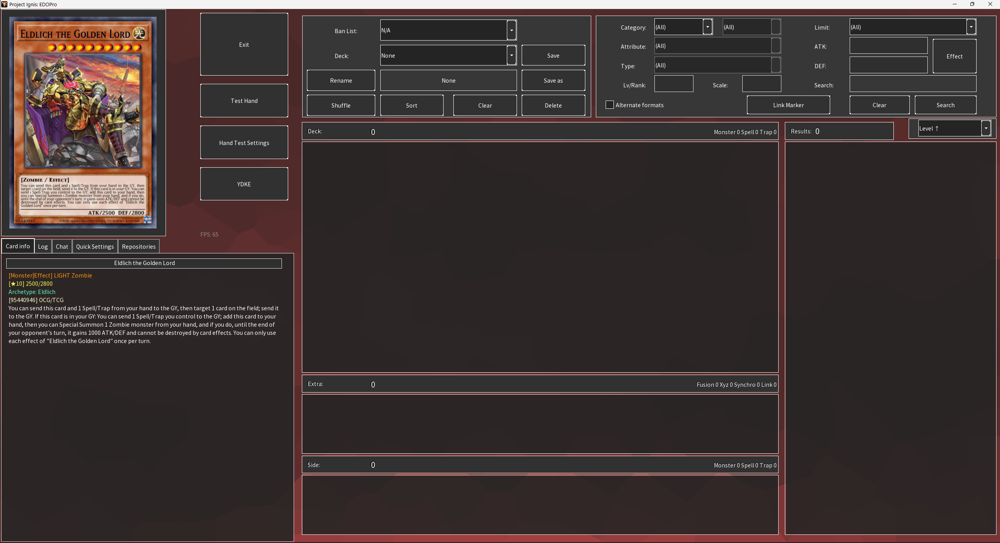
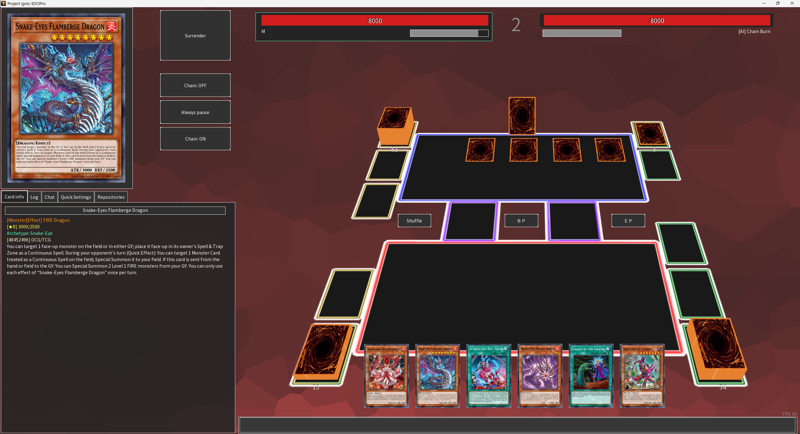
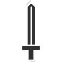

# EDOPro Dark Theme
 Dark Theme for EDOPro 

This was made for Project Ignis: https://projectignis.github.io/ might not work in the other simulators.

# Install

1. Download and extract files then place them into ProjectIgnis/skin.
2. Restart game.
3. Select "EDOPro-Dark-Theme" or "EDOPro-Dark-Theme-Transparent" under skin in the options.

# Screenshots

# Transparent Version

# New Higher Res Icons and Text

