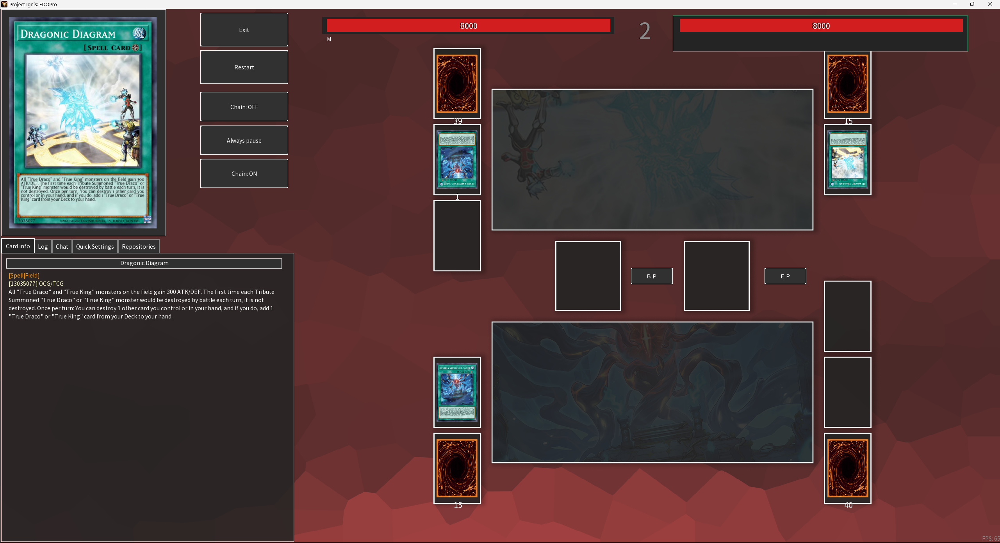
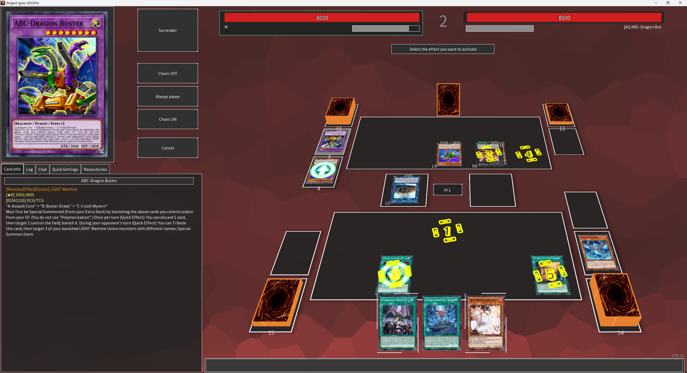
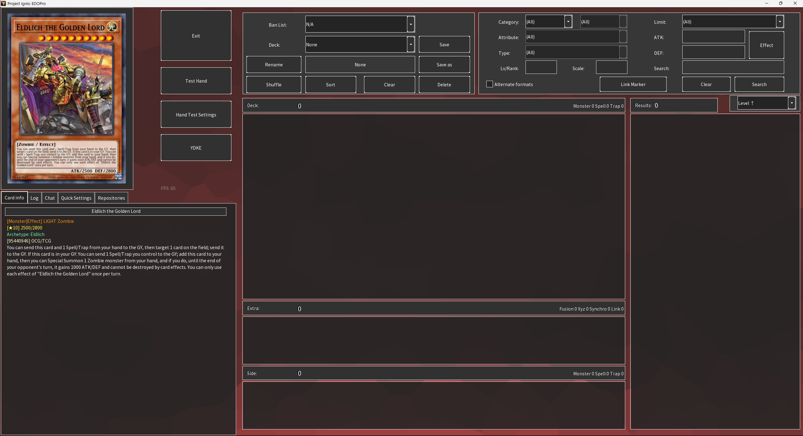
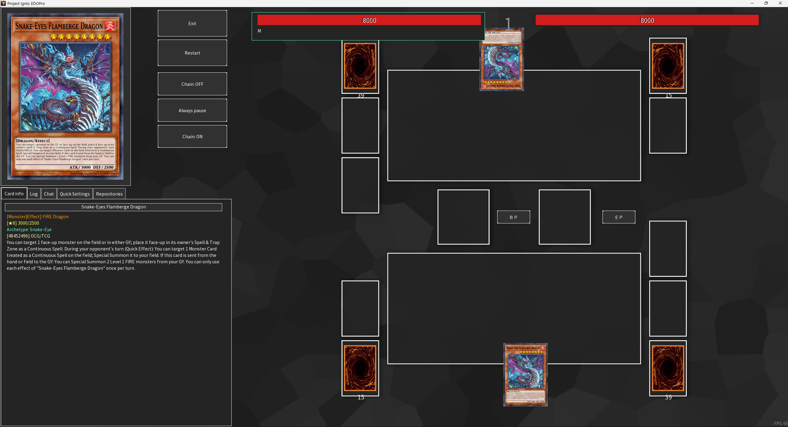
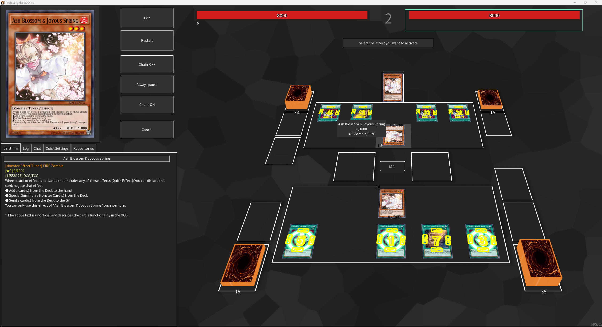
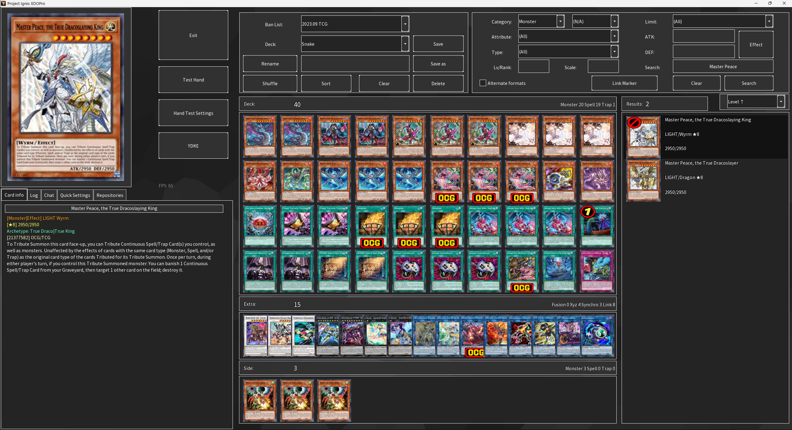
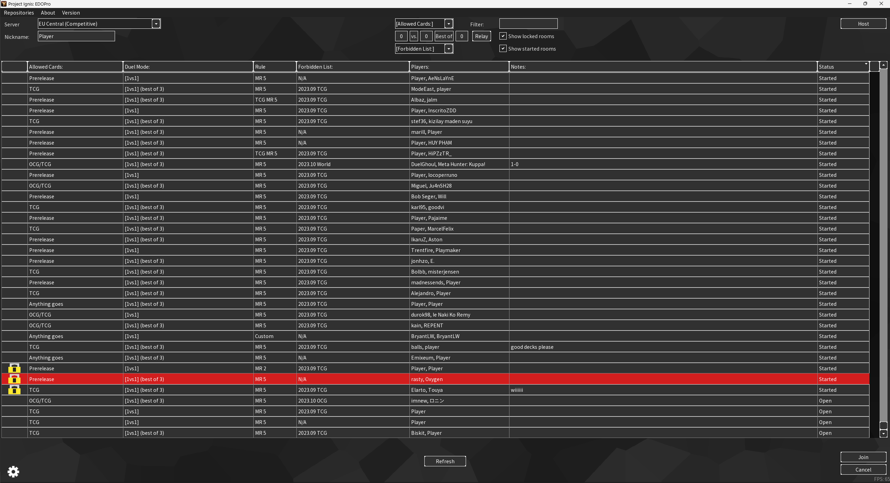
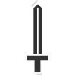
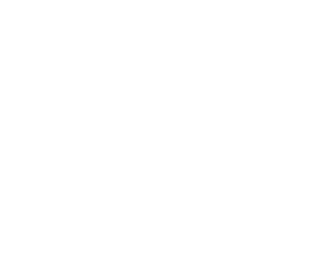

# EDOPro Dark Theme

This was made for Project Ignis: https://projectignis.github.io/ might not work in the other simulators.

# Install

1. Download and extract files then place them into ProjectIgnis/skin.
2. Restart game.
3. Select "EDOPro-Dark-Theme" or "EDOPro-Dark-Theme-Transparent" under skin in the options.

# Optional

* Change the background by replacing the "bg.png" file in the textures folder.

# Transparent

# Opaque

# New Higher Res Icons and Text

